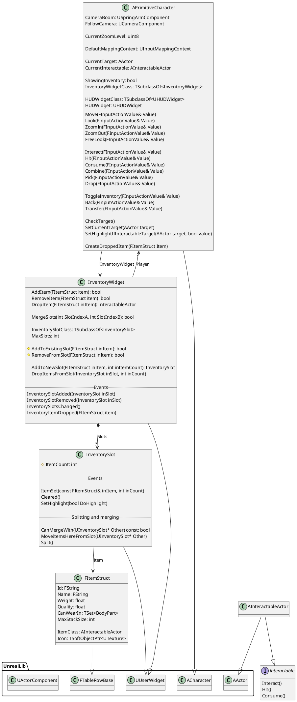
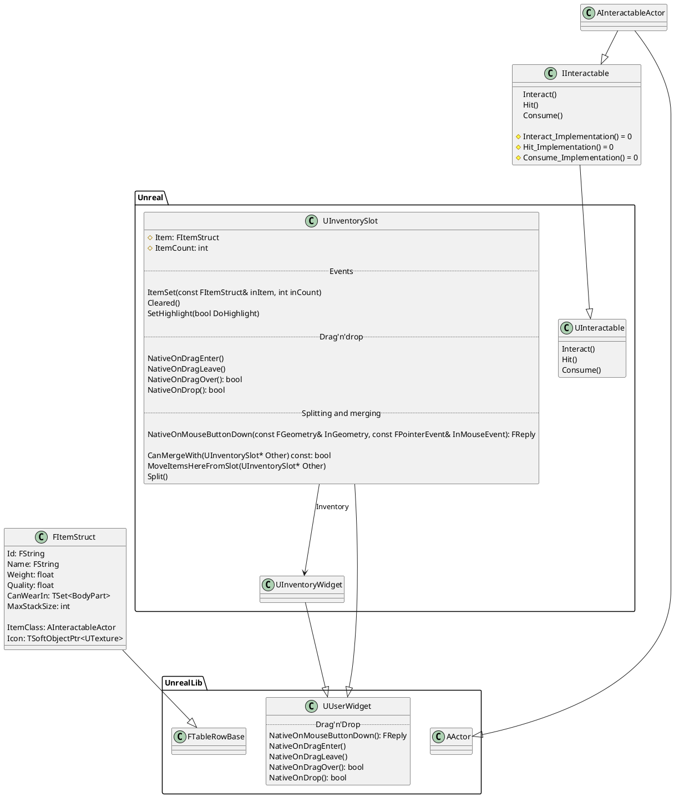

# Design

## Overall Design

```plantuml
@startuml

package UnrealLib {
    class AActor
    class FTableRowBase
    class UUserWidget
    class ACharacter
    class UActorComponent
}

class APrimitiveCharacter {
	CameraBoom: USpringArmComponent
	FollowCamera: UCameraComponent
	
	CurrentZoomLevel: uint8

	DefaultMappingContext: UInputMappingContext
 
	CurrentTarget: AActor
	CurrentInteractable: AInteractableActor

	ShowingInventory: bool
	InventoryWidgetClass: TSubclassOf<InventoryWidget>

	HUDWidgetClass: TSubclassOf<UHUDWidget>
	HUDWidget: UHUDWidget
  
	Move(FInputActionValue& Value)
	Look(FInputActionValue& Value)
	ZoomIn(FInputActionValue& Value)
	ZoomOut(FInputActionValue& Value)
	FreeLook(FInputActionValue& Value)

	Interact(FInputActionValue& Value)
	Hit(FInputActionValue& Value)
	Consume(FInputActionValue& Value)
	Combine(FInputActionValue& Value)
	Pick(FInputActionValue& Value)
	Drop(FInputActionValue& Value)

	ToggleInventory(FInputActionValue& Value)
	Back(FInputActionValue& Value)
	Transfer(FInputActionValue& Value)

	CheckTarget()
	SetCurrentTarget(AActor target)
	SetHighlightIfInteractableTarget(AActor target, bool value)

	CreateDroppedItem(FItemStruct Item)
}

APrimitiveCharacter --|> ACharacter
APrimitiveCharacter --> InventoryWidget: InventoryWidget

class FItemStruct {
    Id: FString
    Name: FString
    Weight: float
    Quality: float
    CanWearIn: TSet<BodyPart>
    MaxStackSize: int

    ItemClass: AInteractableActor
    Icon: TSoftObjectPtr<UTexture>
}

FItemStruct --|> FTableRowBase

interface Interactable {
    Interact()
    Hit()
    Consume()
}

class InventoryWidget {
    AddItem(FItemStruct item): bool
    RemoveItem(FItemStruct item): bool
    DropItem(FItemStruct inItem): InteractableActor

    MergeSlots(int SlotIndexA, int SlotIndexB): bool

    InventorySlotClass: TSubclassOf<InventorySlot>
    MaxSlots: int

    #AddToExistingSlot(FItemStruct inItem): bool
    #RemoveFromSlot(FItemStruct inItem): bool

    AddToNewSlot(FItemStruct inItem, int inItemCount): InventorySlot
    DropItemsFromSlot(InventorySlot inSlot, int inCount)

    ..Events..
    InventorySlotAdded(InventorySlot inSlot)
    InventorySlotRemoved(InventorySlot inSlot)
    InventorySlotsChanged()
    InventoryItemDropped(FItemStruct item)

}
InventoryWidget --> "1" APrimitiveCharacter: Player

class InventorySlot {
    #ItemCount: int

    ..Events..

    ItemSet(const FItemStruct& inItem, int inCount)
    Cleared()
    SetHighlight(bool DoHighlight)

    ..Splitting and merging..

    CanMergeWith(UInventorySlot* Other) const: bool
    MoveItemsHereFromSlot(UInventorySlot* Other)
    Split()
}
InventoryWidget --|> UUserWidget
InventorySlot --|> UUserWidget
InventoryWidget *--> "*" InventorySlot: Slots
InventorySlot --> FItemStruct: Item

AInteractableActor --|> AActor
AInteractableActor --|> Interactable

@enduml
```

## Detailled Design

```plantuml
@startuml


package UnrealLib {
    class AActor
    class FTableRowBase
    class UUserWidget {
        ..Drag'n'Drop..
        NativeOnMouseButtonDown(): FReply
        NativeOnDragEnter()
        NativeOnDragLeave()
        NativeOnDragOver(): bool
        NativeOnDrop(): bool
    }
}


package Unreal {

    class UInteractable {
        Interact()
        Hit()
        Consume()
    }

    class UInventoryWidget {}

    class UInventorySlot {
        #Item: FItemStruct
        #ItemCount: int

        ..Events..

        ItemSet(const FItemStruct& inItem, int inCount)
        Cleared()
        SetHighlight(bool DoHighlight)

        ..Drag'n'drop..

        NativeOnDragEnter()
        NativeOnDragLeave()
        NativeOnDragOver(): bool
        NativeOnDrop(): bool

        ..Splitting and merging..

        NativeOnMouseButtonDown(const FGeometry& InGeometry, const FPointerEvent& InMouseEvent): FReply

        CanMergeWith(UInventorySlot* Other) const: bool
        MoveItemsHereFromSlot(UInventorySlot* Other)
        Split()
    }
    UInventoryWidget --|> UUserWidget
    UInventorySlot --|> UUserWidget
    UInventorySlot --> UInventoryWidget: Inventory
}


class IInteractable {
    Interact()
    Hit()
    Consume()

    #Interact_Implementation() = 0
    #Hit_Implementation() = 0
    #Consume_Implementation() = 0
}

class FItemStruct {
    Id: FString
    Name: FString
    Weight: float
    Quality: float
    CanWearIn: TSet<BodyPart>
    MaxStackSize: int

    ItemClass: AInteractableActor
    Icon: TSoftObjectPtr<UTexture>
}

FItemStruct --|> FTableRowBase

IInteractable --|> UInteractable
AInteractableActor --|> AActor
AInteractableActor --|> IInteractable

@enduml
```
