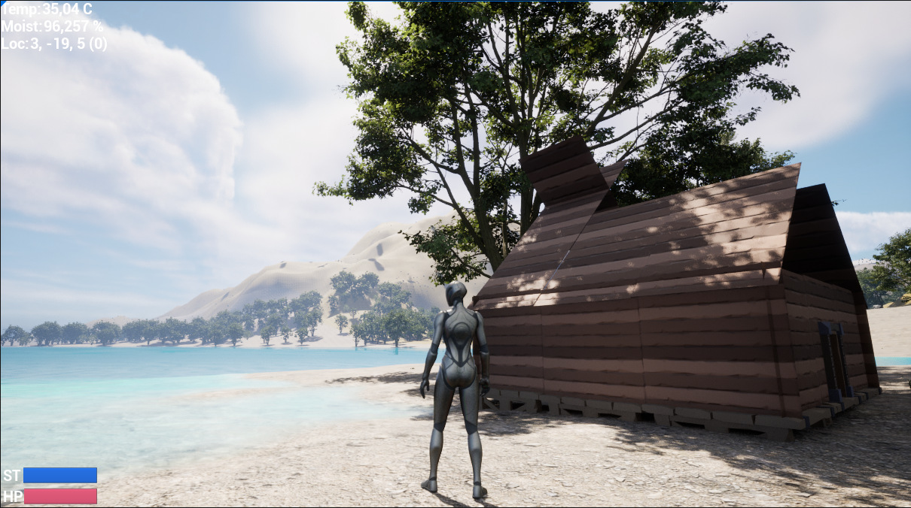
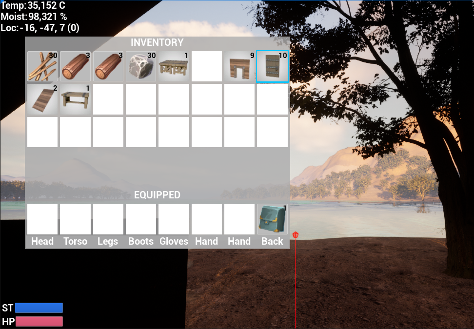

# Primitive

This is my study project on Unreal Engine 5. It tries to become an exploration/survival game.

Recent state of the game has the following main features implemented at least at basic or rudimentary level:

- procedurally generated and editable voxel based world terrain mixed with non-voxel assets like trees and rocks
- harvestable trees and rocks
- some foliage
- the world has varying temperature and moisture levels contributing to local terrain features and flora
- swimmable water at sea level
- third person and first person cameras with zoom in/out
- day-night cycle
- player inventory
- containers like boxes where player can store items
- crafting by player at hand and at a crafting bench
- constructing buildings
- map view (rudimentary, now mostly meant for visually checking the generated terrain)
- sounds from some player actions

Some pictures of the scenery and UI






## Implementation Details

Almost all features are written in C++ with some blueprint support here and there.

The voxel terrain uses the free version of Unreal Engine Voxel Plugin 1.2.

Foliage and havestable trees and rocks are implemented using *instanced static mesh foliages* for performance. The world can already now easily have hundreds of thousands of trees, rocks etc.

Water is simply a large water body at sea level as the Voxel Plugin does not support water voxels.


### About C++ and Unreal Engine

To non-Unreal Engine programmers, certain C++ coding practices may seem odd due Unreal Engine's way of dealing with C++ mostly due its need to automagically integrate C++ and its visual scripting tools aka blueprints.

For example:

- memory management has to rely mostly on Unreal Engine's built-in garbage collector making raw-looking pointers seem unsafe at first glance, but UE inserts GC code using the macros and code generation (e.g. to all ```UPROPERTY(...)``` lines)
- actual written code is not directly compiled, but UE build system generates the actual compiled code including the Visual Studio project files resulting into e.g. special includes and project structures in the source code
- all class, structure and interface definitions are very macro heavy (```UCLASS(...)```, ```USTRUCT(...)```, ```UPROPERTY(...)```, ```UFUNCTION(...)```, ```GENERATED_BODY```...)
- multiple inheritance of implementation cannot really be used and interfaces also have UE specific patterns
- standard C++ STL library is rarely used due UE having only support for its own containers, iterators, shared pointers and such
- standard C++ exceptions cannot be used


### Building the Project

I have excluded some asset packs to save space (over 10+GB), so you need to add these before building from scratch:
- **European Hornbeam**
- **Procedural Nature Pack**
- **Animation Starter Pack**
- **Low Poly Viking World**
- **Infinity Blade: Effects**
